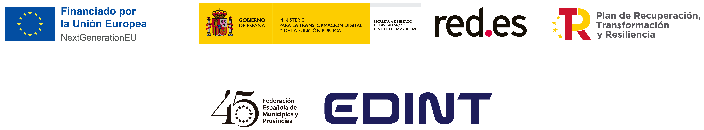

# edint-ontology-catalog
Catálogo de ontologías EDINT para infraestructuras urbanas inteligentes, orientado a la interoperabilidad semántica y alineado con iniciativas de datos abiertos (FEMP, datos.gob.es).

# Financiación (Funding)

Este catalogo ha sido desarrollada en el contexto del Espacio de Datos para las Infraestructuras Urbanas Inteligentes ([EDINT](https://edint.es/)). 

